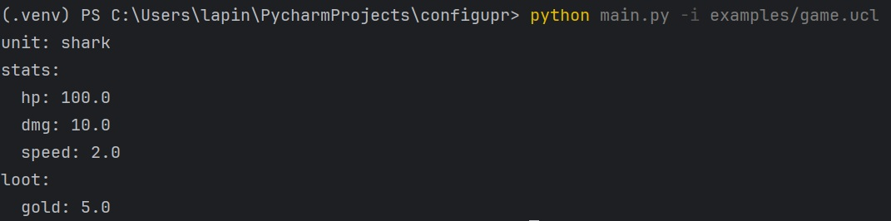

## 1) Общее описание

`ucl2yaml` — консольный инструмент на Python, который читает файл с конфигурацией на учебном конфигурационном языке и преобразует его в YAML.

- **Вход:** текстовый файл (`.ucl`) с описанием конфигурации.
- **Выход:** YAML в стандартный вывод (`stdout`).
- **Ошибки:** при синтаксических/семантических ошибках печатает сообщение в `stderr` и завершает работу с ненулевым кодом.

В работе используется специализированный инструмент синтаксического разбора **Lark (LALR-парсер)**.

---

## 2) Описание функций и настроек

### 2.1. Поддерживаемые конструкции входного языка

#### Числа
Числа задаются **только** в научной нотации (экспоненциальная форма):

```

[+-]?\d+.?\d*[eE][+-]?\d+

````

Примеры:
- `1e+0`
- `-2.5e-1`
- `+3.e+2`

#### Строки
Строки задаются в двойных кавычках:

```text
"Это строка"
````

Поддерживаются escape-последовательности (например `\"`, `\\`, `\n`, `\t`).

#### Словари

Словарь задаётся конструкцией `$[ ... ]`:

```text
$[
  key1: "value",
  key2: 1e+0,
  nested: $[ a: 2e+0, ],
]
```

Особенности:

* Ключи — только имена вида `[a-z]+`
* Значения — число / строка / словарь / ссылка на константу
* Допускается **висячая запятая** перед `]`
* Повтор ключа в словаре считается ошибкой

#### Имена

Имена ключей/констант задаются по правилу:

```
[a-z]+
```

#### Объявление константы на этапе трансляции

Константы объявляются **только в начале документа**:

```text
(def имя значение)
```

Пример:

```text
(def pi 3.14159e+0)
```

Повторное объявление одной и той же константы — ошибка.

#### Вычисление константы на этапе трансляции

Ссылка на константу:

```text
{имя}
```

Пример:

```text
$[ x: {pi}, ]
```

Если константа не объявлена — ошибка.

---

### 2.2. Логика работы программы (модули проекта)

* `ucl_parser.py`

  * грамматика Lark и синтаксический разбор входного текста
  * выявление синтаксических ошибок (с указанием строки и столбца)
  * проверка на повтор ключей в словаре

* `ucl_eval.py`

  * вычисление констант `(def ...)` и подстановка `{имя}`
  * обработка ошибок семантики: неизвестная/повторная константа

* `main.py`

  * обработка аргументов командной строки
  * чтение входного файла
  * запуск парсинга + вычисления
  * вывод YAML в `stdout`

---

## 3) Команды для сборки проекта и запуска тестов

### 3.1. Требования

* Python 3.10+ (рекомендуется 3.12)
* Зависимости: `lark`, `pyyaml`, `pytest`

### 3.2. Установка зависимостей

```bash
pip install -r requirements.txt
```

### 3.3. Запуск тестов

```bash
pytest -q
```

---

## 4) Примеры использования

### 4.1. Запуск транслятора

```bash
python main.py -i examples/devops.ucl
```

### 4.2. Пример входного файла (игровая конфигурация)

Файл `examples/game.ucl`:

```text
(def hp 1e+2)
(def dmg 1e+1)
$[
  unit: "shark",
  stats: $[
    hp: {hp},
    dmg: {dmg},
    speed: 2e+0,
  ],
  loot: $[
    gold: 5e+0,
  ],
]
```

### 4.3. Пример вывода (YAML)



### 4.4. Пример ошибки (неизвестная константа)

Вход:

```text
$[ x: {nope}, ]
```

Вывод в `stderr` (пример):

```text
Неизвестная константа: nope (строка 1, столбец 7)
$[ x: {nope}, ]
      ^
```

---

## Структура проекта

```text
main.py
ucl_parser.py
ucl_eval.py
requirements.txt
tests/
  test_ucl.py
examples/
  devops.ucl
  university.ucl
  game.ucl
```

